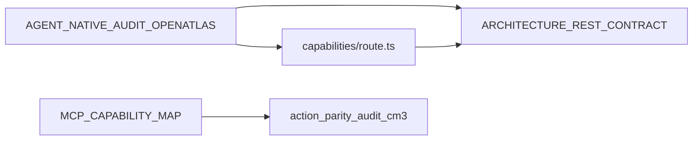

# Grep-driven file list: action parity (starter set)

Repeatable inventories for **Principle 1 (action parity)** work: agent-native framing, REST/MCP surface, and harness MCP docs. Complements the hand-maintained manifest in [`src/app/api/capabilities/route.ts`](../src/app/api/capabilities/route.ts) (OA-REST-2).

**Verify manifest vs filesystem:** `npm run verify:capabilities` (from repo root).

---

## Commands (bash vs Windows)

Run from **`OpenAtlas/`** for queries 1–2, and **`portfolio-harness/`** (parent of OpenAtlas) for query 3.

### Bash / Git Bash

```bash
cd OpenAtlas
rg -l "agent-native|parity|capabilities" --glob "*.md" --glob "*.{ts,tsx}"
rg -l "api/capabilities|/api/" src/app/api
cd ..
rg -l "MCP|tool" docs .cursor
```

### PowerShell

Use `;` not `&&`. Use `2>$null` instead of `2>nul` if redirecting stderr.

```powershell
Set-Location D:\portfolio-harness\OpenAtlas
rg -l "agent-native|parity|capabilities" --glob "*.md" --glob "*.{ts,tsx}"
rg -l "api/capabilities|/api/" src/app/api
Set-Location D:\portfolio-harness
rg -l "MCP|tool" docs .cursor
```

---

## Query 1: `agent-native|parity|capabilities` (`.md` + `.ts`/`.tsx`)

### Markdown (OpenAtlas)

| Path |
|------|
| [CONTRIBUTING.md](../CONTRIBUTING.md) |
| [AGENT_NATIVE_AUDIT_OPENGRIMOIRE.md](./AGENT_NATIVE_AUDIT_OPENGRIMOIRE.md) |
| [ARCHITECTURE_REST_CONTRACT.md](./ARCHITECTURE_REST_CONTRACT.md) |
| [LOCAL_FIRST_NEWS_POINTER.md](./LOCAL_FIRST_NEWS_POINTER.md) |
| [OPENGRIMOIRE_SYSTEMS_INVENTORY.md](./OPENGRIMOIRE_SYSTEMS_INVENTORY.md) |
| [agent/INTEGRATION_PATHS.md](./agent/INTEGRATION_PATHS.md) |
| [plans/SCOPE_OPENATLAS_FULL_REVIEW.md](./plans/SCOPE_OPENATLAS_FULL_REVIEW.md) |
| [plans/2026-03-19-openatlas-alignment-context-design.md](./plans/2026-03-19-openatlas-alignment-context-design.md) |
| [plans/2026-03-19-openatlas-agent-native-audit.md](./plans/2026-03-19-openatlas-agent-native-audit.md) |
| [e2e/maestro/README.md](../e2e/maestro/README.md) |

### TypeScript / TSX

| Path | Note |
|------|------|
| [src/app/api/capabilities/route.ts](../src/app/api/capabilities/route.ts) | Canonical **capabilities manifest**. |
| [src/components/SurveyForm/steps/MotivationStep.tsx](../src/components/SurveyForm/steps/MotivationStep.tsx) | Weak signal: likely “capabilities” in survey copy, not REST parity. Optional for audits. |

**Stricter TS/TSX pattern (optional):** drop UI-only matches:

```bash
rg "parity|agent-native|/api/capabilities" --glob "*.{ts,tsx}"
```

---

## Query 2: `api/capabilities|/api/` in `src/app/api`

Subset of route files whose **source** mentions those strings (not a full route inventory). Typical hits:

- `src/app/api/capabilities/route.ts`
- `src/app/api/alignment-context/route.ts`
- `src/app/api/alignment-context/[id]/route.ts`

For **every** App Router handler, use `rg --files src/app/api` / glob `**/route.ts`, **`CAPABILITIES.routes`** in [`capabilities/route.ts`](../src/app/api/capabilities/route.ts), or `npm run verify:capabilities`.

---

## Query 3: `MCP|tool` in `docs` + `.cursor` (portfolio-harness)

The unfiltered query matches **200+ files** (including `.cursor/state/ai_trends/raw/`, `.cursor/temp/`, ad-hoc state).

### Narrowed search (recommended)

Excludes noisy paths:

```bash
cd portfolio-harness
rg -l "MCP|tool" docs .cursor \
  --glob '!.cursor/state/ai_trends/**' \
  --glob '!.cursor/temp/**'
```

**PowerShell** (ripgrep glob syntax):

```powershell
Set-Location D:\portfolio-harness
rg -l "MCP|tool" docs .cursor --glob '!**/.cursor/state/ai_trends/**' --glob '!**/.cursor/temp/**'
```

**Minimal doc scope** (parity / MCP policy only):

```bash
rg -l "MCP|tool" .cursor/docs docs/cognitive-ergonomics-seed
```

### Curated starter subset (high-signal)

Paths are relative to `portfolio-harness/`:

| File | Role |
|------|------|
| [.cursor/docs/MCP_CAPABILITY_MAP.md](../../.cursor/docs/MCP_CAPABILITY_MAP.md) | Tool-to-action mapping; references CM-3 audit. |
| [.cursor/docs/MCP_SKILL_ROUTING.md](../../.cursor/docs/MCP_SKILL_ROUTING.md) | Skill ↔ MCP routing. |
| [.cursor/docs/AGENT_NATIVE_CHECKLIST.md](../../.cursor/docs/AGENT_NATIVE_CHECKLIST.md) | Cross-stack agent-native checklist. |
| [.cursor/docs/MULTI_STACK_REVIEW_TEMPLATE.md](../../.cursor/docs/MULTI_STACK_REVIEW_TEMPLATE.md) | Evidence template (`action_parity_audit_cm3_*.md`). |
| [.cursor/docs/DAGGR_MCP.md](../../.cursor/docs/DAGGR_MCP.md) | Daggr MCP usage. |
| [.cursor/docs/TOOL_SAFEGUARDS.md](../../.cursor/docs/TOOL_SAFEGUARDS.md) | Tool safety / gates. |
| [docs/cognitive-ergonomics-seed/MCP_OPERATION.md](../../docs/cognitive-ergonomics-seed/MCP_OPERATION.md) | MCP operation (cognitive-ergonomics seed). |
| [.cursor/state/adhoc/action_parity_audit_cm3_2026-03-16.md](../../.cursor/state/adhoc/action_parity_audit_cm3_2026-03-16.md) | Point-in-time CM-3 table; superseded for Daggr by MCP map per its banner. |

---

## Anchor files

| Anchor | Role |
|--------|------|
| [AGENT_NATIVE_AUDIT_OPENGRIMOIRE.md](./AGENT_NATIVE_AUDIT_OPENGRIMOIRE.md) | Gap report; §1 Action parity. |
| [capabilities/route.ts](../src/app/api/capabilities/route.ts) | Machine-readable route manifest. |
| [ARCHITECTURE_REST_CONTRACT.md](./ARCHITECTURE_REST_CONTRACT.md) | Normative REST contract. |
| [portfolio-harness/.cursor/docs/MCP_CAPABILITY_MAP.md](../../.cursor/docs/MCP_CAPABILITY_MAP.md) | Harness-wide MCP ↔ actions. |
| [action_parity_audit_cm3_2026-03-16.md](../../.cursor/state/adhoc/action_parity_audit_cm3_2026-03-16.md) | Historical CM-3 parity table. |



---

## How to use

1. **PRs touching `src/app/api/`:** Update [`capabilities/route.ts`](../src/app/api/capabilities/route.ts) and [ARCHITECTURE_REST_CONTRACT.md](./ARCHITECTURE_REST_CONTRACT.md) in the same PR ([CONTRIBUTING.md](../CONTRIBUTING.md)). Run `npm run verify:capabilities`.
2. **Parity review:** Start from §1 in the agent-native audit; cross-check `CAPABILITIES.routes` vs `verify:capabilities` and Query 1–2 for stale docs.
3. **Multi-stack (WatchTower / campaign_kb):** Prefer [MCP_CAPABILITY_MAP.md](../../.cursor/docs/MCP_CAPABILITY_MAP.md) over stale CM-3 counts; use CM-3 for historical narrative only.
