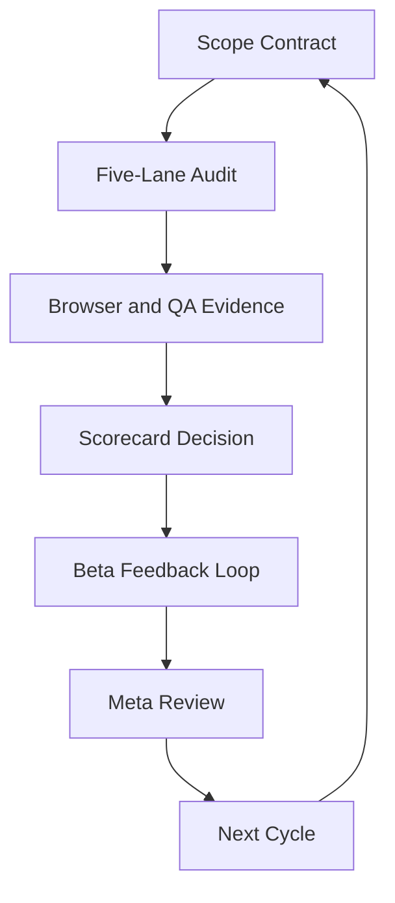

# OpenGrimoire Beta Audit Checklist and Go/No-Go Scorecard

## Purpose

This document defines the operational audit for deciding whether OpenGrimoire is ready for an MVP Beta cohort. It is meant for product, engineering, QA, and operator reviewers who need one repeatable checklist for scope, verification, launch readiness, and post-launch feedback.

The Beta launch policy is strict:

- OpenGrimoire is **No-Go** if any critical gate fails.
- OpenGrimoire is **No-Go** if any open `P0` or `P1` issue exists without a verified fix.
- Non-critical scores are useful for trend tracking, but they cannot override a failed critical gate.
- Waivers are allowed only for non-critical items and must include an owner, mitigation, and review date.

## How to Use This Document

Run this checklist before inviting a new Beta cohort, after major changes to core user flows, and once per weekly Beta hardening cycle.

1. Confirm the Beta-ready contract is still accurate.
2. Complete the five-lane audit checklist.
3. Run browser and QA verification.
4. Fill the Go/No-Go scorecard.
5. File a decision record and link the evidence pack.
6. Feed findings into the next Beta hardening cycle.



## Beta-Ready Contract

### Target Personas

| Persona | Primary need | Beta success signal |
|---|---|---|
| Beta explorer | Understand what OpenGrimoire offers and try the core experience without operator help. | Completes first meaningful interaction and can describe what happened. |
| Admin operator | Monitor system health, moderation, capabilities, and user activity during Beta. | Can detect and triage operational issues from `/admin` surfaces. |
| Contributor or tester | Report issues with enough context for the team to reproduce and prioritize. | Files feedback with route, steps, expected result, actual result, and severity. |

### Core Jobs To Be Done

- A Beta explorer can enter OpenGrimoire, understand the available experience, and complete one core flow.
- An admin operator can sign in, inspect operational surfaces, and confirm whether the app is healthy enough for testers.
- A tester can report a bug or friction point through the agreed feedback channel.
- The team can connect user feedback, telemetry, and verification evidence to a launch decision.

### Must-Pass User Flows

| Flow ID | Flow | Expected result | Critical |
|---|---|---|---|
| `BF-01` | Visitor opens the primary app route and reaches the intended entry experience. | Page loads without a 5xx, blank state, or unhandled error boundary. | Yes |
| `BF-02` | Beta explorer completes the primary OpenGrimoire interaction selected for MVP Beta. | User reaches a clear success or next-step state with no hidden operator intervention. | Yes |
| `BF-03` | Admin operator signs in and opens `/admin`. | Admin shell loads behind the correct session gate and shows operational navigation. | Yes |
| `BF-04` | Admin operator checks moderation, activity, health, or observability surfaces. | Each selected surface loads an expected table, empty state, or health state. | Yes |
| `BF-05` | Tester submits or records Beta feedback through the agreed channel. | Feedback contains route, steps, expected result, actual result, severity, and contact or session reference. | Yes |

### Objective Acceptance Criteria

| ID | Acceptance criterion | Evidence required | Gate |
|---|---|---|---|
| `AC-01` | The selected MVP Beta scope is documented and names the included routes, flows, and excluded work. | Scope section in this document or linked release note. | Critical |
| `AC-02` | `npm run verify` exits `0` on the release candidate commit. | Terminal excerpt, CI job link, or verification report. | Critical |
| `AC-03` | The primary app route loads locally or in staging without 5xx, blank screen, or unhandled error boundary. | Browser review report with snapshot and screenshot. | Critical |
| `AC-04` | The primary Beta user flow reaches a success or next-step state. | Browser review report with steps and evidence. | Critical |
| `AC-05` | Admin access to `/admin` is session-gated and works for the admin test account or documented dev path. | Browser review report and auth notes without secrets. | Critical |
| `AC-06` | Operator health or observability surfaces expose enough signal to triage Beta incidents. | Screenshot or report covering health, observability, or capability state. | Critical |
| `AC-07` | No open `P0` or `P1` defects remain for included Beta flows. | Issue tracker query or release checklist summary. | Critical |
| `AC-08` | Feedback intake is live and documented for testers. | Feedback form/link/process and bug report template. | Critical |
| `AC-09` | Privacy and security review confirms no sensitive data is exposed in Beta-facing or admin-only surfaces beyond intended policy. | Security/privacy checklist completion and issue query. | Critical |
| `AC-10` | Console and network checks for critical flows show no unexpected errors or failed critical requests. | Browser review console and network summary. | Critical |
| `AC-11` | Beta blocker triage process names owner, severity rules, SLA, and weekly review cadence. | Operations cadence section completed. | Critical |
| `AC-12` | Documentation needed by operators and testers is current enough to run the Beta without oral tradition. | Links to this checklist, human verification guide, and feedback instructions. | Critical |
| `AC-13` | Non-critical usability issues are logged with owner and mitigation date. | Issue tracker or risk register. | Non-critical |
| `AC-14` | Beta telemetry captures enough event, route, and error context to diagnose common failures. | Telemetry checklist or instrumentation report. | Non-critical unless required by launch owner |
| `AC-15` | Recent agent/process activity has been meta-reviewed for drift, repeated failure modes, or missing rules. | Meta-review note or decision record. | Non-critical unless drift affects critical gates |

## Severity Definitions

| Severity | Definition | Beta launch impact |
|---|---|---|
| `P0` | Data loss, security exposure, total app outage, or impossible core flow. | Hard No-Go. |
| `P1` | Critical Beta flow broken, admin cannot triage incidents, or auth/access policy fails. | Hard No-Go. |
| `P2` | Important flow degraded with workaround or clear mitigation. | May proceed only if non-critical and owner accepts risk. |
| `P3` | Polish, copy, visual inconsistency, or minor confusion. | Track for Beta hardening. |

## Five-Lane Audit Checklist

Use this section as the working audit sheet. Fill `Owner`, `Status`, `Evidence`, and `Due` for each row.

Status values: `PASS`, `FAIL`, `N/A`, `WAIVED`.

### Lane 1: Product Fit

| Check | Owner | Severity | Status | Evidence | Due |
|---|---|---|---|---|---|
| MVP Beta includes only flows that can be verified by this checklist. | Product lead | P1 |  |  |  |
| Target personas and jobs-to-be-done are agreed by product and engineering. | Product lead | P1 |  |  |  |
| Each must-pass flow maps to at least one acceptance criterion. | Product lead | P1 |  |  |  |
| Excluded work is named so reviewers do not treat it as a launch blocker. | Product lead | P2 |  |  |  |
| Beta success metric is defined for activation, completion, or useful feedback. | Product lead | P2 |  |  |  |

### Lane 2: UX Quality

| Check | Owner | Severity | Status | Evidence | Due |
|---|---|---|---|---|---|
| Primary entry route explains what the user can do next. | Design/product | P1 |  |  |  |
| Primary Beta flow has a visible success, completion, or next-step state. | Design/product | P1 |  |  |  |
| Empty states explain whether the user should wait, retry, configure, or contact support. | Design/product | P2 |  |  |  |
| Error states are understandable and do not expose secrets or internal stack traces. | Engineering | P1 |  |  |  |
| Mobile and desktop viewports are usable for the selected Beta flows. | QA | P2 |  |  |  |
| Admin surfaces distinguish healthy, degraded, empty, and failed states. | Engineering | P1 |  |  |  |

### Lane 3: Reliability

| Check | Owner | Severity | Status | Evidence | Due |
|---|---|---|---|---|---|
| `npm run verify` passes on the release candidate commit. | Engineering | P1 |  |  |  |
| Critical API routes used by Beta flows return expected status and payload shape. | Engineering | P1 |  |  |  |
| Slow or failed dependencies produce bounded error states instead of blank UI. | Engineering | P1 |  |  |  |
| Admin health/capability indicators reflect enough state to triage degraded operation. | Engineering | P1 |  |  |  |
| Restart or redeploy procedure is known and documented for the Beta environment. | Operations | P2 |  |  |  |
| Rollback plan exists for the release candidate. | Operations | P1 |  |  |  |

### Lane 4: Security and Privacy

| Check | Owner | Severity | Status | Evidence | Due |
|---|---|---|---|---|---|
| Admin routes remain session-gated and unavailable to non-admin users. | Engineering | P1 |  |  |  |
| Beta routes expose only intended data for the current environment. | Engineering | P1 |  |  |  |
| Feedback intake does not request secrets, private keys, or unnecessary sensitive data. | Product/ops | P1 |  |  |  |
| Logs, screenshots, and reports avoid secrets and redact sensitive values. | QA/ops | P1 |  |  |  |
| Any AI-generated or agent-assisted action has a clear human/operator boundary. | Product/engineering | P2 |  |  |  |
| Known auth, read-gate, or capability policies are checked against the current release candidate. | Engineering | P1 |  |  |  |

### Lane 5: Observability and Support

| Check | Owner | Severity | Status | Evidence | Due |
|---|---|---|---|---|---|
| Beta feedback channel is live and linked from tester instructions. | Operations | P1 |  |  |  |
| Bug report template captures route, steps, expected result, actual result, severity, environment, and screenshot/log reference. | Operations | P1 |  |  |  |
| Critical client and server errors are visible to operators during the Beta window. | Engineering | P1 |  |  |  |
| Admin operator can inspect health, activity, or observability surfaces without developer-only knowledge. | Operations | P1 |  |  |  |
| Weekly triage owner and cadence are named. | Operations | P1 |  |  |  |
| Beta blockers have an escalation path and SLA. | Operations | P1 |  |  |  |

## Evidence-Based Verification Protocol

### Browser Review Protocol

Complete this section for each Beta release candidate.

```markdown
## BrowserReviewSpec
- Base URL:
- Release candidate commit:
- Auth: none | test account | dev bypass
- Viewports:
  - 375x667
  - 1280x720
- Routes:
  - /
  - /admin
  - /admin/observability
  - /visualization or /constellation, if included in Beta scope
- Flows:
  1. Visitor opens primary app route -> Expected: entry experience loads with no 5xx or blank state.
  2. Beta explorer completes primary OpenGrimoire interaction -> Expected: success or next-step state.
  3. Admin signs in and opens /admin -> Expected: admin shell loads behind session gate.
  4. Admin checks health/activity/moderation/observability -> Expected: table, empty state, or health state is coherent.
  5. Tester files feedback -> Expected: issue or form entry includes required repro fields.
- Critical screens:
  - Primary app entry route
  - Primary Beta flow success or next-step state
  - Admin shell
  - Health, moderation, activity, or observability surface
```

Required browser evidence:

| Evidence | Required for | Pass condition |
|---|---|---|
| Snapshot | Every critical screen | DOM structure confirms expected state is present. |
| Screenshot | Every critical screen after snapshot readiness | Visual state is legible and matches expected flow outcome. |
| Console summary | Every reviewed route | No unexpected red errors on critical flows. |
| Network summary | Every reviewed route | No unexpected 4xx/5xx or blocked critical requests. |
| Flow result table | Every must-pass flow | Each flow is `PASS`; failures include repro steps and severity. |

### QA Verification Protocol

Run the project verification commands from the OpenGrimoire repo root. If a command is unavailable, mark it `N/A` with reason and identify the nearest replacement.

| Verification | Command or action | Required | Pass condition | Evidence |
|---|---|---|---|---|
| Repo install state | `npm install` or existing clean install confirmation | First run or dependency change | Dependencies install without failure. | Terminal excerpt or CI setup log |
| Full verification | `npm run verify` | Yes | Exits `0`. | CI link or terminal excerpt |
| Production read-gate semantics | `npm run verify:survey-read-prod` | If Beta includes survey/read-gated surfaces | Exits `0`. | CI link or terminal excerpt |
| E2E or browser smoke | Existing Playwright or manual BrowserReviewSpec execution | Yes | Must-pass flows pass. | Browser review report |
| Accessibility smoke | Existing accessibility script or manual review | If available | No critical keyboard, contrast, or landmark blocker for included flows. | Report or issue list |
| Security/privacy review | Manual checklist in this document | Yes | No P0/P1 security or privacy issues. | Completed checklist |

### Verification Report Template

```markdown
## OpenGrimoire Beta Verification Report

- Date:
- Release candidate commit:
- Environment: local | staging | production candidate
- Reviewer:
- Decision: PASS | FAIL

### Commands
| Command | Result | Evidence |
|---|---|---|
| npm run verify |  |  |
| npm run verify:survey-read-prod |  |  |

### Browser Flows
| Flow | Result | Notes | Evidence |
|---|---|---|---|
| BF-01 |  |  |  |
| BF-02 |  |  |  |
| BF-03 |  |  |  |
| BF-04 |  |  |  |
| BF-05 |  |  |  |

### Console and Network
- Console:
- Failed requests:

### Blockers
- P0:
- P1:
- Other:
```

## Go/No-Go Scorecard

### Critical Gates

All critical gates must be `PASS`.

| Gate ID | Gate | Owner | Result | Evidence | Notes |
|---|---|---|---|---|---|
| `G-01` | MVP Beta scope is documented and accepted. | Product lead |  |  |  |
| `G-02` | `npm run verify` passes on release candidate. | Engineering |  |  |  |
| `G-03` | All must-pass browser flows pass. | QA |  |  |  |
| `G-04` | No open `P0` or `P1` issues exist for included Beta scope. | Release owner |  |  |  |
| `G-05` | Admin session gate and operator surfaces work. | Engineering |  |  |  |
| `G-06` | Security/privacy checklist has no critical failure. | Security/engineering |  |  |  |
| `G-07` | Feedback intake and triage process are live. | Operations |  |  |  |
| `G-08` | Rollback and incident escalation paths are known. | Operations |  |  |  |
| `G-09` | Evidence pack is filed and linked from the decision record. | QA/release owner |  |  |  |

### Hard Blocking Conditions

The decision is automatically **No-Go** if any condition below is true:

- Any critical gate is `FAIL` or blank.
- Any `P0` or `P1` issue remains open.
- Admin auth/session policy is unverified or fails.
- Primary Beta flow cannot be completed by a tester.
- Verification evidence is missing for a claimed pass.
- Feedback intake is unavailable.
- A security or privacy reviewer identifies a critical exposure.
- Release owner cannot identify rollback or escalation procedure.

### Non-Critical Health Score

This score helps track Beta maturity across cycles. It does not override critical gates.

Scoring:

- `2` = healthy
- `1` = usable with known mitigation
- `0` = weak, missing, or not reviewed

| Area | Score | Evidence | Follow-up owner |
|---|---:|---|---|
| Onboarding clarity |  |  |  |
| Empty/error state quality |  |  |  |
| Mobile usability |  |  |  |
| Admin information architecture |  |  |  |
| Telemetry usefulness |  |  |  |
| Documentation freshness |  |  |  |
| Support handoff quality |  |  |  |
| Agent/process governance |  |  |  |

Interpretation:

- `14-16`: Healthy Beta posture if all critical gates pass.
- `10-13`: Launch may proceed only if all critical gates pass and follow-ups are scheduled.
- `0-9`: Do not expand cohort; harden before wider Beta even if critical gates pass.

### Final Decision Block

```markdown
## Beta Launch Decision

- Release candidate:
- Date:
- Decision: Go | No-Go
- Decision owner:
- Product sign-off:
- Engineering sign-off:
- QA sign-off:
- Operations sign-off:
- Security/privacy sign-off:

### Required statement
All critical gates are PASS, no P0/P1 issues are open, and the evidence pack is linked below.

### Evidence pack
- Verification report:
- Browser screenshots/snapshots:
- CI or terminal verification:
- Issue tracker query:
- Feedback intake:
- Rollback notes:

### Notes
-
```

## Beta Feedback Loop and Operations Cadence

### Feedback Intake Requirements

Tester feedback must capture:

- Route or feature area.
- Steps to reproduce.
- Expected result.
- Actual result.
- Severity estimate.
- Environment: browser, device, local/staging/prod candidate.
- Screenshot, console summary, or session reference when available.
- Whether the user is blocked.

Do not ask testers to paste secrets, tokens, private keys, or sensitive personal data.

### Severity Triage Rules

| Severity | Triage SLA | Owner expectation |
|---|---|---|
| `P0` | Same day | Stop expansion; assign immediate owner; notify release owner. |
| `P1` | 1 business day | Block launch or cohort expansion until fixed and verified. |
| `P2` | 3 business days | Schedule mitigation or accept with explicit owner approval. |
| `P3` | Weekly | Batch into hardening backlog. |

### Weekly Beta Hardening Cycle

1. Review all new Beta feedback and classify severity.
2. Confirm no new `P0` or `P1` issues are open.
3. Re-run affected browser flows and relevant QA checks.
4. Update the non-critical health score.
5. Run a short meta-review of agent/process drift and repeated failure modes.
6. Publish a decision note: expand cohort, hold cohort, or pause Beta.

## Governance and Process Quality Loop

### Meta-Review Checklist

Run this check weekly during Beta or after a major incident.

| Check | Status | Evidence | Follow-up |
|---|---|---|---|
| Recent agent runs or handoffs align with the current Beta objective. |  |  |  |
| Repeated failure modes have a documented mitigation or rule/skill backlog item. |  |  |  |
| Review comments and verification failures were resolved with evidence, not assertion. |  |  |  |
| Known process gaps are tracked in pending tasks or the issue tracker. |  |  |  |
| No governance drift affects launch-critical decisions. |  |  |  |

### Tech-Lead Coherence Prompts

Use these prompts when the audit uncovers implementation or boundary questions:

- Does this belong in the app, admin surface, integration contract, or operations runbook?
- Is this a Beta blocker, a hardening task, or explicitly out of scope?
- Does this change preserve auth, read-gate, and capability boundaries?
- Are user-facing actions and operator-facing controls clearly separated?
- Can another engineer verify this without relying on private chat history?

### Documentation Freshness Checks

Before each Beta decision, confirm the following docs or equivalents are current:

| Document area | Required state |
|---|---|
| Beta audit checklist | This document is updated for the current release candidate. |
| Human verification guide | Machine and GUI verification instructions match the repo scripts and routes. |
| Admin/operator docs | Admin access, observability, moderation, and health expectations are current. |
| Integration contracts | Panel, capability, or operator cockpit contracts do not contradict shipped behavior. |
| Feedback instructions | Testers know how to report bugs and what not to include. |

## Execution Workflow

### Phase WBS

| Phase | Owner role | Dependencies | Output | Done when |
|---|---|---|---|---|
| 1. Scope lock | Product lead | Current release candidate selected | Beta-ready contract | Personas, flows, and acceptance criteria are approved. |
| 2. Five-lane audit | Product, engineering, QA, ops | Scope lock | Completed checklist | All rows have status, owner, evidence, or mitigation. |
| 3. Browser evidence | QA or reviewer | App running locally or in staging | Browser review report | Must-pass flows have PASS/FAIL and evidence. |
| 4. Static/runtime verification | Engineering or QA | Release candidate installable | Verification report | Required commands are PASS or explicitly blocked. |
| 5. Scorecard decision | Release owner | Audit and evidence complete | Go/No-Go decision | Critical gates are filled and decision is signed. |
| 6. Feedback loop setup | Operations | Decision owner named | Intake and triage process | Feedback channel, severity rules, and SLA are live. |
| 7. Governance review | Release owner or agent operator | First cycle evidence | Meta-review notes | Process gaps are tracked and assigned. |
| 8. Cohort operation | Product/ops | Go decision | Beta cohort plan | Cohort size, comms, support window, and patch cadence are named. |

### Cohort Rollout Guidance

| Stage | Suggested cohort | Gate to advance |
|---|---:|---|
| Internal dogfood | 1-3 operators/testers | No P0/P1 after one full audit cycle. |
| Private Beta seed | 5-10 trusted testers | Must-pass flows remain green; feedback intake works. |
| Expanded Beta | 20-50 testers | Weekly hardening cycle stable; P2 volume is manageable. |

### Beta Exit Criteria

OpenGrimoire can move beyond MVP Beta only when:

- All critical gates have passed for at least one full weekly cycle.
- No open `P0` or `P1` issues remain.
- Primary Beta flow completion is consistently observed or manually verified.
- Admin operators can triage incidents without developer-only intervention.
- Feedback volume and severity trend are stable enough for a wider release.
- Documentation and rollback paths are current.

## Decision Record Template

Copy this block into the release issue, handoff, or operations log.

```markdown
## OpenGrimoire Beta Audit Decision

- Date:
- Release candidate:
- Base URL:
- Decision: Go | No-Go
- Decision owner:

### Critical gate summary
| Gate | Result | Evidence |
|---|---|---|
| G-01 Scope accepted |  |  |
| G-02 npm run verify |  |  |
| G-03 Browser flows |  |  |
| G-04 No P0/P1 |  |  |
| G-05 Admin/operator surfaces |  |  |
| G-06 Security/privacy |  |  |
| G-07 Feedback intake |  |  |
| G-08 Rollback/escalation |  |  |
| G-09 Evidence pack |  |  |

### Follow-ups
- P2:
- P3:
- Process/documentation:

### Sign-off
- Product:
- Engineering:
- QA:
- Operations:
- Security/privacy:
```
