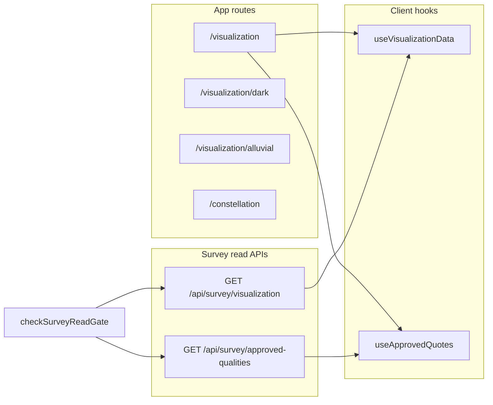

# OA-FR-2 — System 2 Data visualization

**Harness ID:** OA-FR-2  
**Charter:** [SCOPE_OPENGRIMOIRE_FULL_REVIEW.md](./SCOPE_OPENGRIMOIRE_FULL_REVIEW.md) — System 2  
**Status:** Matrix + gaps + verification (this document).  
**Normative contracts:** [ARCHITECTURE_REST_CONTRACT.md](../ARCHITECTURE_REST_CONTRACT.md) · [AGENT_INTEGRATION.md](../AGENT_INTEGRATION.md) · [PUBLIC_SURFACE_AUDIT.md](../security/PUBLIC_SURFACE_AUDIT.md)  
**Related system:** Survey reads and gates are shared with OA-FR-1 — [OA_FR_1_SYSTEM1_SURVEY_MODERATION.md](./OA_FR_1_SYSTEM1_SURVEY_MODERATION.md) REQ-S1.2.  
**GUI audit (this system):** [gui-2026-04-16-opengrimoire-data-viz.md](../audit/gui-2026-04-16-opengrimoire-data-viz.md).

---

## 1. Scope and surfaces

### 1.1 Data flow (canonical)



### 1.2 UI routes

| Surface | Path | Implementation | Data / notes |
|---------|------|----------------|--------------|
| Primary viz (Layout) | `/visualization` | [`src/app/visualization/page.tsx`](../../src/app/visualization/page.tsx) → [`DataVisualization`](../../src/components/DataVisualization/index.tsx) | `useVisualizationData` + header `useApprovedQuotes`; `AppContext` auto-play + theme. |
| Dark entry | `/visualization/dark` | [`src/app/visualization/dark/page.tsx`](../../src/app/visualization/dark/page.tsx) | Same `DataVisualization`; forces dark (`toggleDarkMode`, `documentElement` class). |
| Alluvial-only | `/visualization/alluvial` | [`src/app/visualization/alluvial/page.tsx`](../../src/app/visualization/alluvial/page.tsx) | Renders [`AlluvialDiagram`](../../src/components/DataVisualization/AlluvialDiagram.tsx) only (no full header/tabs). |
| Constellation | `/constellation` | [`src/app/constellation/page.tsx`](../../src/app/constellation/page.tsx) | Dynamic import of [`visualization/ConstellationView`](../../src/components/visualization/ConstellationView.tsx) inside [`VisualizationContainer`](../../src/components/DataVisualization/shared/VisualizationContainer.tsx). Uses **Zustand** [`visualizationStore`](../../src/store/visualizationStore.ts) + [`fetchVisualizationData`](../../src/lib/visualization/fetchVisualizationData.ts) — not the same fetch shape as `useVisualizationData` (see §1.5). |
| Nav bar | (global) | [`SharedNavBar.tsx`](../../src/components/SharedNavBar.tsx), home [`page.tsx`](../../src/app/page.tsx) | Link to `/visualization`. |

**Legacy / alternate bundle:** [`src/components/visualization/`](../../src/components/visualization) (Three.js, `Visualization` default export) is used from [`/test`](../../src/app/test/page.tsx). It is **not** the same tree as [`src/components/DataVisualization/`](../../src/components/DataVisualization).

### 1.3 APIs (PII-capable)

| API | File | Gate | Response cache |
|-----|------|------|------------------|
| `GET /api/survey/visualization` | [`src/app/api/survey/visualization/route.ts`](../../src/app/api/survey/visualization/route.ts) | `checkSurveyReadGate` | `Cache-Control: private, no-store` |
| `GET /api/survey/approved-qualities` | [`src/app/api/survey/approved-qualities/route.ts`](../../src/app/api/survey/approved-qualities/route.ts) | Same | `Cache-Control: private, no-store` |

**Query semantics (`visualization`):**

- `all=1` → `showTestData` is **`null`** in code → [`getVisualizationData(null)`](../../src/lib/storage/repositories/survey.ts) returns **all** survey rows (no server filter on `test_data`).
- `all` absent / not `1` → `showTestData` from `showTestData=true|false` → filters by `test_data` column.

**Approved quotes source:** [`getApprovedUniqueQualities`](../../src/lib/storage/repositories/survey.ts) — SQL requires `moderation` row for `field_name = 'unique_quality'` with `status = 'approved'` and non-empty `unique_quality`.

Production gate matrix (headers, cookies, env): **do not duplicate** — see [ARCHITECTURE_REST_CONTRACT.md § Survey read endpoints](../ARCHITECTURE_REST_CONTRACT.md) and [AGENT_INTEGRATION.md](../AGENT_INTEGRATION.md).

### 1.4 Client hooks and UI wiring

| Hook | File | Fetches | Consumers |
|------|------|---------|-----------|
| `useVisualizationData` | [`useVisualizationData.ts`](../../src/components/DataVisualization/shared/useVisualizationData.ts) | `GET /api/survey/visualization?all=1` + `credentials: 'include'` | **Shipped:** [`AlluvialDiagram`](../../src/components/DataVisualization/AlluvialDiagram.tsx), [`ChordDiagram`](../../src/components/DataVisualization/ChordDiagram.tsx). **Orphan:** [`DataVisualization/Constellation/ConstellationView`](../../src/components/DataVisualization/Constellation/ConstellationView.tsx) also calls the hook but has **no** `src/app/**` importer — live `/constellation` uses [`visualization/ConstellationView`](../../src/components/visualization/ConstellationView.tsx) + Zustand instead. |
| `useApprovedQuotes` | [`useApprovedQuotes.ts`](../../src/components/DataVisualization/shared/useApprovedQuotes.ts) | `GET /api/survey/approved-qualities` + `credentials: 'include'` | [`EnhancedVisualizationHeader`](../../src/components/DataVisualization/shared/EnhancedVisualizationHeader.tsx) — quote slot `data-region="opengrimoire-viz-quote-slot"`; rotates every **8s** when `quotes.length > 1`. |

**Auto-play and theme:** [`AppContext.tsx`](../../src/lib/context/AppContext.tsx) exposes `isAutoPlayEnabled`, `autoPlaySpeed`, `toggleAutoPlay`, `isDarkMode`, `useTestData`. [`DataVisualization/index.tsx`](../../src/components/DataVisualization/index.tsx) passes `autoPlay={settings.isAutoPlayEnabled}` into Alluvial and Chord. Operator-facing copy: [`/admin/controls`](../../src/app/admin/controls/page.tsx).

**A11y / test ids:** Stable ids in [`vizLayoutIds.ts`](../../src/components/DataVisualization/shared/vizLayoutIds.ts); diagrams expose `data-testid="alluvial-diagram"` / `data-testid="chord-diagram"`; canvas region `data-region="opengrimoire-viz-canvas"`.

### 1.5 Two client fetch shapes (avoid conflation)

| Path | Function | Typical query | Used by |
|------|----------|---------------|---------|
| Survey alluvial/chord hook | `useVisualizationData` | `?all=1` | Main `/visualization` diagrams |
| Zustand / export-style | [`fetchVisualizationData.ts`](../../src/lib/visualization/fetchVisualizationData.ts) | `?showTestData={true\|false}&all=0` | [`visualizationStore`](../../src/store/visualizationStore.ts), [`constellationStore`](../../src/store/constellationStore.ts), [`export.ts`](../../src/lib/utils/export.ts) |

When `all=0`, the API applies the `showTestData` filter; when `all=1`, the server returns the full row set for the hook to validate and dedupe by `attendee_id`.

### 1.6 Middleware-gated test routes

Defined in [`middleware.ts`](../../middleware.ts) as `TEST_ROUTE_PREFIXES`: `/test`, `/test-chord`, `/test-context`, `/test-sqlite`. In **`NODE_ENV=production`**, these return **404** unless `OPENGRIMOIRE_ALLOW_TEST_ROUTES` is `1` or `true`. Matcher entries must stay in sync with the prefix list (comment in file).

| Route | Purpose | Survey / API dependency |
|-------|---------|-------------------------|
| `/test` | Legacy Three + [`Visualization`](../../src/components/visualization) inside [`TestEnvironment`](../../src/components/TestEnvironment.tsx) | **Local fixtures** — [`loadTestData`](../../src/lib/testUtils.ts) / simulation; **not** wired to `GET /api/survey/visualization` unless test utils change |
| `/test-chord` | Isolated D3 chord lab | **None** — in-page [`mockData`](../../src/app/test-chord/page.tsx) + [`chordUtils`](../../src/components/DataVisualization/shared/chordUtils.ts) only |
| `/test-context` | Toggles `AppContext` (dark, test data, auto-play) | **No HTTP** — client-only |
| `/test-sqlite` | SQLite smoke | `fetch('/api/survey/visualization?all=1')` — documents gate + JSON shape |

### 1.7 NavigationDots (legacy nav targets)

[`NavigationDots.tsx`](../../src/components/DataVisualization/shared/NavigationDots.tsx) lists `/constellation`, `/tapestry`, `/comparison`, `/waves`, `/qualities`. **`/constellation` exists**; as of this matrix authorship there are **no** matching `src/app/tapestry|comparison|waves|qualities` pages — treat as **orphan nav** unless another app hosts them. Gap recorded below.

---

## 2. Requirements and acceptance criteria

### REQ-S2.1 — Primary visualization page (`/visualization`)

| ID | Requirement | Acceptance criteria (observer) |
|----|-------------|--------------------------------|
| S2.1.1 | User can switch Alluvial vs Chord. | Tab controls in header; `role="tabpanel"` on main panel with `aria-labelledby` tied to [`vizLayoutIds`](../../src/components/DataVisualization/shared/vizLayoutIds.ts). |
| S2.1.2 | Diagram receives live survey data when API succeeds. | Network: `GET /api/survey/visualization?all=1` **200**; diagram renders (SVG/canvas per [e2e/visualization.spec.ts](../../e2e/visualization.spec.ts)). |
| S2.1.3 | Empty or unusable payload falls back safely. | Zero valid rows after validation → in-hook **mock** data; `isMockData` true ([`useVisualizationData`](../../src/components/DataVisualization/shared/useVisualizationData.ts)). |
| S2.1.4 | Fetch failures retry then mock. | Up to 3 retries with backoff; then error state + mock fallback. |
| S2.1.5 | Auto-play respects global setting. | Toggle via header or `/test-context` / admin controls: `autoPlay` prop matches `settings.isAutoPlayEnabled`. |

### REQ-S2.2 — Approved quotes (header)

| ID | Requirement | Acceptance criteria |
|----|-------------|---------------------|
| S2.2.1 | Quotes load from approved moderation only. | `GET /api/survey/approved-qualities` **200** returns `items` filtered to approved `unique_quality` (server + client trim). |
| S2.2.2 | Quote rotation is bounded. | Multiple quotes: index advances every 8s; single quote: no interval churn. |
| S2.2.3 | Loading / empty states do not break layout. | Header shows “Loading…” or empty slot per [`EnhancedVisualizationHeader`](../../src/components/DataVisualization/shared/EnhancedVisualizationHeader.tsx). |

### REQ-S2.3 — Survey read gate parity (System 2 consumer)

| ID | Requirement | Acceptance criteria |
|----|-------------|---------------------|
| S2.3.1 | Both survey GETs used by viz share the same gate. | Unauthenticated production calls denied per OA-FR-1 S1.2.1 / ARCHITECTURE (visualization + approved-qualities). |
| S2.3.2 | Session cookies sent from browser. | Client `fetch` uses `credentials: 'include'` on both hooks. |

### REQ-S2.4 — Debug and logging gates

| ID | Requirement | Acceptance criteria |
|----|-------------|---------------------|
| S2.4.1 | Verbose viz client logs are dev-gated. | With **`NEXT_PUBLIC_DEBUG_VISUALIZATION` unset** and default dev: no `logViz` noise from [`useVisualizationData`](../../src/components/DataVisualization/shared/useVisualizationData.ts). With **`NEXT_PUBLIC_DEBUG_VISUALIZATION=1`** and `NODE_ENV=development`: structured `logViz` / `warnViz` allowed. |
| S2.4.2 | No survey row payloads in client logs (F1 remediation). | DevTools console: no dumps of `attendee` / full row objects from visualization path. |
| S2.4.3 | Server errors do not leak stack in JSON body. | Forced DB failure → **500** `{ error: string }` + server `console.error` only. |

### REQ-S2.5 — Performance posture (documentation-level)

| ID | Requirement | Acceptance criteria |
|----|-------------|---------------------|
| S2.5.1 | No silent perf contract in CI. | OpenGrimoire repo: **no** dedicated Lighthouse / Web Vitals workflow in `.github/workflows` at matrix time — large D3 diagrams are **best-effort**; regressions caught via manual review or optional Playwright smoke (layout mounts). |
| S2.5.2 | Animations can be disabled. | Auto-play off → diagrams should not advance on timer-driven story steps (spot-check Alluvial/Chord). |

### REQ-S2.6 — Test / demo routes

| ID | Requirement | Acceptance criteria |
|----|-------------|---------------------|
| S2.6.1 | Test routes blocked in production by default. | Without `OPENGRIMOIRE_ALLOW_TEST_ROUTES`, `/test*` family → **404** HTML from middleware. |
| S2.6.2 | E2E documents baseline. | [`e2e/test-routes.spec.ts`](../../e2e/test-routes.spec.ts) covers `/test-chord` heading; [`e2e/visualization.spec.ts`](../../e2e/visualization.spec.ts) covers `/visualization`. |

---

## 3. Gap list (vs code + public audit)

| Gap ID | Description | Severity | Source |
|--------|-------------|----------|--------|
| G-S2-01 | F1 remediation: client must not log survey row samples. | Critical (remediated) | **PUBLIC_SURFACE_AUDIT F1** — verify [`useVisualizationData.ts`](../../src/components/DataVisualization/shared/useVisualizationData.ts) |
| G-S2-02 | F4: residual unconditional `console.*` on visualization path. | Medium | **PUBLIC_SURFACE_AUDIT F4** — [`DataVisualization/index.tsx`](../../src/components/DataVisualization/index.tsx) logs on **auto-play setting change** unconditionally; [`AlluvialDiagram.tsx`](../../src/components/DataVisualization/AlluvialDiagram.tsx) and [`ChordDiagram.tsx`](../../src/components/DataVisualization/ChordDiagram.tsx) emit **many** unconditional `console.log` calls on layout/animation paths (not gated by `NEXT_PUBLIC_DEBUG_VISUALIZATION`); [`visualization/ConstellationView.tsx`](../../src/components/visualization/ConstellationView.tsx) logs each render; `useApprovedQuotes` uses `console.error` on failure (errors only; still noisy). |
| G-S2-03 | F5: error logging may include rich `Error` objects in some paths. | Medium | **PUBLIC_SURFACE_AUDIT F5** — spot-check forced `GET` failures in DevTools |
| G-S2-04 | `NavigationDots` targets `/tapestry`, `/comparison`, `/waves`, `/qualities` without matching `app` routes. | Low (UX / dead links) | **Code** — [`NavigationDots.tsx`](../../src/components/DataVisualization/shared/NavigationDots.tsx) |
| G-S2-05 | Two visualization architectures (DataVisualization vs `components/visualization` + Zustand). | Low (maintainability) | **Code** — increases onboarding cost; document-only unless consolidating |
| G-S2-06 | `all=1` bypasses `showTestData` filter — intentional for hook, but operators must understand PII mix. | Low (ops clarity) | **Code** + ARCHITECTURE |

---

## 4. Verification and smoke checklist

### 4.1 Preconditions

- Repo root: `npm install`, `npm run dev` (port per [README](../../README.md) / local habit; Playwright often uses **3001** — see [`playwright.config.ts`](../../playwright.config.ts)).
- For **production-gate** checks: build with `NODE_ENV=production` and exercise headers per [ARCHITECTURE_REST_CONTRACT.md](../ARCHITECTURE_REST_CONTRACT.md) § Survey read endpoints.

### 4.2 Browser (observer)

1. Open `/visualization` — expect **Alluvial** or **Chord** mount (`data-testid` alluvial/chord).
2. Open DevTools → **Console** — confirm no full survey row / attendee dumps (F1). Expect **layout/animation debug noise** from Alluvial/Chord unless gated in code (G-S2-02); that noise is **not** the same failure mode as logging raw survey rows.
3. Toggle Alluvial/Chord tabs — focus order and `aria-labelledby` sane (keyboard: ArrowUp/Down between tabs per header).
4. Open `/visualization/dark` — dark shell + `DataVisualization`.
5. With moderation data: header quote slot shows text; without: empty or loading state.

### 4.3 HTTP (dev, ungated)

```bash
curl -sS "http://localhost:3001/api/survey/visualization?all=1" | head -c 200
curl -sS "http://localhost:3001/api/survey/approved-qualities" | head -c 200
```

Expect **200** JSON with `data` / `items` in development. In production without auth, expect gate **4xx** per OA-FR-1.

### 4.4 Optional Playwright

```bash
npx playwright test e2e/visualization.spec.ts
npx playwright test e2e/test-routes.spec.ts
```

### 4.5 Operator doc pointers

- Debug viz logging: [`ANIMATION_DEBUG_GUIDE.md`](../../ANIMATION_DEBUG_GUIDE.md) (mentions `useVisualizationData` and `NEXT_PUBLIC_DEBUG_VISUALIZATION`).
- Capabilities map: `GET /api/capabilities` lists survey visualization paths ([`capabilities/route.ts`](../../src/app/api/capabilities/route.ts)).

---

## 5. Completion

Mark harness **OA-FR-2** done in [MiscRepos `.cursor/state/pending_tasks.md`](../../../MiscRepos/.cursor/state/pending_tasks.md) when this document is merged and stakeholders accept the verification bar. Further work (perf CI, consolidating viz stacks, fixing `NavigationDots`) is **out of scope** for the minimum OA-FR-2 deliverable unless promoted to a new task.
