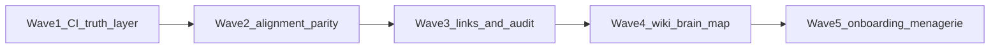

# OpenGrimoire base features — engineering plan

**Normative spec:** [OPENGRIMOIRE_BASE_FEATURES.md](../OPENGRIMOIRE_BASE_FEATURES.md)  
**Systems inventory:** [OPENGRIMOIRE_SYSTEMS_INVENTORY.md](../OPENGRIMOIRE_SYSTEMS_INVENTORY.md)  
**REST contract:** [ARCHITECTURE_REST_CONTRACT.md](../ARCHITECTURE_REST_CONTRACT.md)  
**Wiki mirror operator doc:** [WIKI_MIRROR.md](../WIKI_MIRROR.md)

**Purpose:** This document is the **execution companion** to the base-features spec. It records **engineering decisions** (ADR-lite), **waves** (sequenced delivery), **task decomposition** (Definition of Done per item), and **verification hooks** (what “green” must mean). It does **not** replace the spec; when they conflict, update the spec first, then this plan.

**Audience:** Implementers, CI maintainers, and operators running hybrid MiscRepos + OpenGrimoire layouts.

**Last updated:** 2026-04-16

---

## Executive summary

The base-features spec is **product-scope complete** (numbered REQ + AC tables) but **not yet fully CI-mechanical**: several ACs rely on prose, code review, or manual steps. Minimal **Phase B wiki** (`/wiki`, `public/wiki`, read-only, escaped plaintext) is **shipped**; remaining work clusters into **parity tests** (alignment REST vs MCP), **durable primitives** (links + audit events with schema + migrations), **wiki provenance** (sync manifest in UI), and **onboarding smoke** (Playwright or scripted health checks).

---

## How to use this document

1. Pick a **wave**; only start Wave N+1 when Wave N exit criteria are met (or explicitly waived with a decision note).
2. For each **REQ**, execute tasks top-down; each task ends with a **Definition of Done** an independent observer can verify.
3. When adding **UI or API** surfaces, fill the **Agent-native parity** row for that REQ (or defer with explicit “orphan UI” risk accepted by human).

---

## Engineering waves (sequencing)

**Rationale:** Establish CI truth and harness seam **before** expanding product surface; alignment parity is the highest-risk divergence point; links + audit are **atoms** for later graph/wiki work; wiki + brain map **harden** on top; onboarding + menagerie **wrap** once invariants exist.

### Wave 1 — CI truth layer and harness seam

| ID | Task | Definition of Done |
|----|------|---------------------|
| W1.1 | Publish a **mechanical AC matrix** (spreadsheet or table in-repo) listing each REQ × “CI can prove / cannot yet prove”. | Table committed under `docs/plans/` or linked from this file § Verification rollup; no orphan REQ rows. |
| W1.2 | Add **fixture JSON** for brain-map graph smoke (`public/` test fixture or `src/test/fixtures/`) consumed by a small **route-level or handler-level test**. | `npm run test` includes ≥1 test that loads graph JSON shape per [BRAIN_MAP_SCHEMA.md](../BRAIN_MAP_SCHEMA.md) (subset OK). |
| W1.3 | Document **harness vs OG ownership** one-pager (what OpenHarness must not own vs may reference). | New subsection in [OPENGRIMOIRE_SYSTEMS_INVENTORY.md](../OPENGRIMOIRE_SYSTEMS_INVENTORY.md) or link to ADR stub; cross-link [OpenHarness HANDOFF_FLOW.md](../../../OpenHarness/docs/HANDOFF_FLOW.md). |
| **Exit** | | Wave 2 may start when W1.1–W1.3 are merged and `npm run verify` stays green. |

### Wave 2 — Alignment REST + MCP parity core

| ID | Task | Definition of Done |
|----|------|---------------------|
| W2.1 | Extract **shared validation** for alignment create/patch payloads (single module imported by REST route handlers). | One module under `src/lib/` (or existing alignment lib); REST handlers call it; no duplicated zod/schema logic in route files. |
| W2.2 | Add **golden parity tests**: same representative payloads succeed through **HTTP** (in-process `fetch` to route or handler test) and **MCP tool** path (thin wrapper calls same URL or shared client). | Vitest suite documented in this plan § REQ-4; CI runs it in `npm run test`. |
| W2.3 | Add **CI guard** for MCP thinness (grep/script: any future in-repo MCP adapter tree must not import heavy domain modules beyond allowed list) OR explicit codeowners checklist. | Script in `scripts/` + `npm run verify:*` hook, or documented reviewer gate in CONTRIBUTING. |
| **Exit** | | REQ-4.1/4.2 marked “CI-verified” in the mechanical AC matrix. |

### Wave 3 — Links and audit atoms

| ID | Task | Definition of Done |
|----|------|---------------------|
| W3.1 | **ADR:** choose audit store — SQLite `operator_events` table vs append-only NDJSON vs hybrid (index + raw). | ADR section appended below § ADR log; migration path documented. |
| W3.2 | Freeze **LinkRecord v1** JSON schema (fields, types, `schema_version`, immutability rules). | `docs/` JSON schema or TypeScript type + export in OpenAPI partial if applicable. |
| W3.3 | Implement minimal **append** + **list/filter** API (or file reader) for operator-visible events behind existing auth patterns. | Contract doc + tests; no PII without REQ-7.2 policy link. |
| **Exit** | | REQ-6 and REQ-7 have “schema exists + tests green” in the mechanical AC matrix. |

### Wave 4 — Wiki and brain map hardening

| ID | Task | Definition of Done |
|----|------|---------------------|
| W4.1 | **Mirror manifest:** MiscRepos `Run-LlmWikiScheduledPipeline.ps1` (or small helper) writes `public/wiki/.mirror-manifest.json` (timestamp, optional vault path redacted hash, robocopy exit). | File format documented in [WIKI_MIRROR.md](../WIKI_MIRROR.md); `/wiki` UI surfaces manifest when present (REQ-1.2). |
| W4.2 | **Wikilink resolver (read-only):** parse `[[Relative/Path]]` in mirror body → link to `/wiki/...` without search or edit. | Unit tests for resolver; no arbitrary URL schemes. |
| W4.3 | Optional **`react-markdown`** (or similar) behind env flag for readable mirror; default stays escaped plaintext if safer for CI. | Flag documented; XSS review note in ADR. |
| W4.4 | Brain map **fixture + API smoke** aligned with [MiscRepos BRAIN_MAP_E2E.md](../../../MiscRepos/docs/BRAIN_MAP_E2E.md) default paths. | Test asserts documented file precedence (`brain-map-graph.local.json` vs `.json`). |
| **Exit** | | REQ-1.2 and REQ-2.1 upgraded to “partial+CI” or “met” per spec edit. |

### Wave 5 — Onboarding shell and menagerie v0 stub

| ID | Task | Definition of Done |
|----|------|---------------------|
| W5.1 | Refresh **MiscRepos** onboarding docs for `/wiki` + manifest ([CONTEXT_PKM_PREREQUISITES.md](../../../MiscRepos/docs/CONTEXT_PKM_PREREQUISITES.md), [CONTEXT_PKM_E2E_DEMO.md](../../../MiscRepos/docs/CONTEXT_PKM_E2E_DEMO.md)). | PR merged; checklist includes “open `/wiki`”. |
| W5.2 | Optional **Playwright** smoke: hit `/wiki` and `/context-atlas` on dev server (extend existing e2e config). | `npm run test:e2e` stable in CI or documented skip with reason. |
| W5.3 | **Menagerie v0** behind feature flag: SQLite + CRUD + list UI + **no** “run agent” server workflow (REQ-5.2). | ADR + minimal API + parity table row. |
| **Exit** | | REQ-5.1 “stub shipped” or explicitly deferred with new target date in ADR log. |

---

## REQ-by-REQ breakdown (product-scope template)

Each block follows: **Intent → Current state → Gaps vs AC → ADR-lite decisions → Work breakdown → Verification hooks → Agent-native notes.**

### REQ-1 — SSOT contract (wiki mirror)

1. **Intent:** Operators must never confuse mirror with vault canon; no write-back from OG to vault via mirror.
2. **Current state:** **Partial.** Banner + copy on [`/wiki` layout](../../src/app/wiki/layout.tsx); safe read paths in [`wikiMirror.ts`](../../src/lib/wikiMirror.ts); [WIKI_MIRROR.md](../WIKI_MIRROR.md) documents sync.
3. **Gaps vs AC:** REQ-1.2 wants **sync metadata in UI** beyond file `mtime` (optional manifest not yet written by default sync).
4. **ADR-lite decisions:** (A) Manifest JSON at `public/wiki/.mirror-manifest.json` written only by MiscRepos sync — **default.** (B) OG never writes mirror — **invariant.** (C) Checksum optional v2 — defer until robocopy wrapper records hashes.
5. **Work breakdown:** W4.1; spec bump REQ-1.2 when manifest lands; add example manifest to docs.
6. **Verification hooks:** Vitest for manifest parser (if added); manual: run sync → refresh `/wiki` → manifest visible.
7. **Agent-native notes:** Agents continue to use **vault MCP / filesystem** for authoring; OG mirror remains **read**; no new “edit wiki” MCP until parity table exists.

### REQ-2 — Wiki viewer / navigation (Phase B)

1. **Intent:** Browse mirrored tree in-app; degraded state visible when empty.
2. **Current state:** **Partial (minimal shipped).** [`/wiki` optional catch-all](../../src/app/wiki/[[...slug]]/page.tsx): index (cap 400), per-page escaped plaintext, empty-state panel with sync command.
3. **Gaps vs AC:** REQ-2.1 internal `[[wikilinks]]` not routed; no markdown rendering; no bundled sample mirror in repo (by design + `.gitignore`).
4. **ADR-lite decisions:** Wikilink resolver before search — **default** (W4.2). Markdown render — **flagged optional** (W4.3).
5. **Work breakdown:** W4.2, W4.3; update REQ-2.1 text in spec when resolver ships.
6. **Verification hooks:** Component/unit tests for link extraction; Playwright optional (W5.2).
7. **Agent-native notes:** Prefer **primitive** “list mirror paths” as filesystem/MCP from repo root for agents; OG UI is convenience, not sole read path.

### REQ-3 — Brain map consumption

1. **Intent:** JSON on disk + API + UI; multi-root and vault roots documented.
2. **Current state:** **Largely aligned** with Phase A in inventory; routes `/context-atlas`, `/brain-map`, `GET /api/brain-map/graph`.
3. **Gaps vs AC:** CI does not yet **freeze** a golden graph response vs [BRAIN_MAP_E2E.md](../../../MiscRepos/docs/BRAIN_MAP_E2E.md) path precedence.
4. **ADR-lite decisions:** Keep static JSON contract — **default**; optional SQLite index later — defer.
5. **Work breakdown:** W1.2, W4.4; doc cross-check PORT_REGISTRY.
6. **Verification hooks:** `npm run test` fixture test; optional Playwright graph container visible.
7. **Agent-native notes:** Agents use `build_brain_map.py` + file read; parity if UI adds exclusive filters not available to agents — avoid.

### REQ-4 — Alignment context REST + MCP parity

1. **Intent:** Same semantics for REST and MCP; MCP remains thin `fetch`.
2. **Current state:** **Partial.** Thin MCP pattern documented in [AGENT_TOOL_MANIFEST.md](../AGENT_TOOL_MANIFEST.md) (harness-local MCP; no `mcp-server/` package in this repo); no automated **same-payload** proof in CI.
3. **Gaps vs AC:** REQ-4.1/4.2 need mechanical enforcement.
4. **ADR-lite decisions:** Shared validation module — **default** (W2.1); golden tests — **default** (W2.2); ban fat MCP — **default** (W2.3).
5. **Work breakdown:** Wave 2 tasks.
6. **Verification hooks:** `npm run test`; extend `verify:*` only if a new script is warranted.
7. **Agent-native notes:** No workflow tool `alignment_run_full_cycle`; keep CRUD primitives.

### REQ-5 — Agent registry (menagerie v0)

1. **Intent:** Structured agent profiles + list/detail; no bundled agent runner in OG.
2. **Current state:** **Not started** (spec-only).
3. **Gaps vs AC:** Schema, API, UI, OpenAPI row, feature flag.
4. **ADR-lite decisions:** Store in SQLite — **default**; ship behind `NEXT_PUBLIC_MENAGERIE` or server flag — **default**; **no** subprocess spawn from OG — **invariant.**
5. **Work breakdown:** W5.3; ADR in § ADR log.
6. **Verification hooks:** Migration tests (drizzle); API tests; manual product review for REQ-5.2.
7. **Agent-native notes:** Every UI CRUD action maps to REST + thin MCP tools.

### REQ-6 — Link primitive

1. **Intent:** Joinable references between alignment rows, wiki paths, future agent ids.
2. **Current state:** **Under-specified**; risk of ad-hoc strings in alignment `body` only.
3. **Gaps vs AC:** No versioned `LinkRecord`, no export API.
4. **ADR-lite decisions:** **LinkRecord v1** table + UUID keys — **default**; optional JSON export endpoint — **stretch** in Wave 3.
5. **Work breakdown:** W3.2–W3.3 subset focused on links first.
6. **Verification hooks:** Schema validation tests; migration up/down.
7. **Agent-native notes:** Expose `list_links` / `create_link` primitives, not “link everything” workflow.

### REQ-7 — Audit / telemetry slice

1. **Intent:** Append-only operator-visible events with filters (sync, alignment, lifecycle).
2. **Current state:** **Likely gap**; no unified event stream matching AC unless piggybacking on existing logs.
3. **Gaps vs AC:** REQ-7.1 filterable query; REQ-7.2 policy link before storing sensitive fields.
4. **ADR-lite decisions:** See Wave 3 — SQLite events table **default** for query; redacted fields list in docs.
5. **Work breakdown:** W3.1, W3.3.
6. **Verification hooks:** API tests for filters; no secrets in responses in CI fixtures.
7. **Agent-native notes:** `append_event` primitive + `list_events` with time/agent filter.

### REQ-8 — Operator onboarding

1. **Intent:** One-path clone → dev → see atlas + wiki + optional alignment.
2. **Current state:** **Partial.** MiscRepos docs updated for hybrid path; `/wiki` exists.
3. **Gaps vs AC:** CI does not prove “fresh clone” story; Playwright optional.
4. **ADR-lite decisions:** Playwright smoke in CI — **optional** if flaky; scripted `curl` health — **acceptable** alternative.
5. **Work breakdown:** W5.1, W5.2.
6. **Verification hooks:** Doc checklist + optional e2e job.
7. **Agent-native notes:** Document agent commands mirroring human checklist ([MCP_CAPABILITY_MAP.md](../../../MiscRepos/.cursor/docs/MCP_CAPABILITY_MAP.md)).

### REQ-9 — Governance seam (OpenHarness)

1. **Intent:** Clear boundaries: harness portable patterns vs OG product state.
2. **Current state:** **Doc-level good** (inventory + spec); runtime enforcement mostly discipline.
3. **Gaps vs AC:** Optional cheap CI grep for forbidden imports (OG importing harness internals).
4. **ADR-lite decisions:** Heuristic grep in `scripts/` — **optional**; human review — **default** until script exists.
5. **Work breakdown:** W1.3; optional script in Wave 1/2.
6. **Verification hooks:** Script in `npm run verify` if added.
7. **Agent-native notes:** Harness docs reference OG by **URL + id**, not embedded DB dumps.

### REQ-10 — Completion signals (agent sessions)

1. **Intent:** Explicit artifacts per session type; not “model stopped talking.”
2. **Current state:** **Process** via MiscRepos + vault docs ([LLM_WIKI_VAULT.md](../../../MiscRepos/local-proto/docs/LLM_WIKI_VAULT.md)).
3. **Gaps vs AC:** No OG runtime enforcement (nor should it for all session types).
4. **ADR-lite decisions:** Keep enforcement in **harness + vault** — **default**; OG may add **optional** checklist page linking to MiscRepos — **stretch**.
5. **Work breakdown:** Optional MiscRepos validator script (non-OG) cited from onboarding doc.
6. **Verification hooks:** Script exits 0/1 in CI only if adopted.
7. **Agent-native notes:** Prefer explicit `complete_task` or log line conventions in prompts; document, don’t code into OG unless product requires it.

---

## Agent-native guardrails (verbatim policy)

- **Parity:** Any new OG-only UI path that replaces filesystem access needs a **thin** agent path (REST/MCP or documented `run_terminal_cmd` + file roots)—never orphan the UI.
- **Granularity:** Prefer **primitives** (`list_events`, `get_link_graph`) over `run_full_operator_review` mega-tools.
- **Forbidden anti-pattern:** No **workflow-shaped MCP tools**; **no duplicate business logic** in MCP vs REST—**shared core only**, adapters stay dumb (see [AGENT_TOOL_MANIFEST.md](../AGENT_TOOL_MANIFEST.md) § Workspace MCP).

---

## Out of scope (explicit deferrals)

| Topic | Defer until |
|-------|-------------|
| Hosted multi-tenant wiki sync | REQ-1 stable + security review |
| Obsidian-in-browser editing from OG | Explicit product decision; breaks read-only invariant |
| Full-text search across mirror from OG | REQ-2.1 wikilinks + perf budget |
| Automatic menagerie ↔ brain-map graph fusion | REQ-6 links + REQ-7 events stable |
| Replacing vault SSOT with OG-native wiki | Explicit non-goal per hybrid model |

---

## ADR log (running)

| Date | ID | Decision | Status |
|------|-----|----------|--------|
| 2026-04-16 | ADR-000 | This engineering plan is the execution companion to OPENGRIMOIRE_BASE_FEATURES; waves gate sequencing. | Accepted |
| TBD | ADR-001 | Audit store: SQLite `operator_events` vs NDJSON — decide in Wave 3. | Proposed |
| TBD | ADR-002 | LinkRecord v1 field list — decide in Wave 3. | Proposed |

---

## Verification rollup (commands)

| Command | When |
|---------|------|
| `npm run verify` | Every PR touching OpenGrimoire app or MCP |
| `npm run test` | Required; must include new parity/unit tests as waves land |
| `npm run test:e2e` | Optional until W5.2 stabilizes; document in CI |
| `node scripts/alignment-context-cli.mjs` | Manual alignment smoke per [ALIGNMENT_CONTEXT_API.md](../agent/ALIGNMENT_CONTEXT_API.md) |

---

## Related plans and reviews

- [SCOPE_OPENGRIMOIRE_FULL_REVIEW.md](./SCOPE_OPENGRIMOIRE_FULL_REVIEW.md) — OA-FR product review charter  
- [MiscRepos context_graph_foam_obsidian_e2e_demo_plan.md](../../../MiscRepos/.cursor/plans/context_graph_foam_obsidian_e2e_demo_plan.md) — PKM operator journey  
- [AGENT_NATIVE_AUDIT_OPENGRIMOIRE.md](../AGENT_NATIVE_AUDIT_OPENGRIMOIRE.md) — agent-native gap report  

---

## Changelog

| Date | Change |
|------|--------|
| 2026-04-16 | Initial plan: waves, per-REQ template, ADR stub, verification rollup. |
