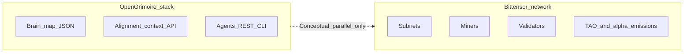

# Bittensor evaluation — full analysis

**Status:** Research note for internal strategy. Not financial, legal, or investment advice.

**API caveat:** [Bittensor.ai API documentation](https://bittensor.ai/docs) states that programmatic REST/WebSocket access and developer keys are **coming soon**. On-chain verification and the [official emissions docs](https://docs.bittensor.com/emissions) remain the authoritative sources for mechanics; any third-party dashboard or scraper should be treated as **non-authoritative** unless reconciled with Subtensor.

**See also:** [Subnet strategic atlas](./SUBNET_STRATEGIC_ATLAS.md) — dated netuid inventory, per-subnet briefs, role/lane placement matrix, and verification checklist aligned with this note.

---

## Executive summary

**What Bittensor is (operationally):** A Substrate-based L1 (“Subtensor”) that coordinates **subnets**—competitive arenas where **miners** produce work and **validators** score that work. New **TAO** and subnet **alpha** tokens are emitted on a schedule; subnet-level allocation has moved to a **flow-based (“Taoflow”)** model (as of November 2025) driven by **net TAO staking/unstaking flows**, with per-tempo distribution inside each subnet via **Yuma Consensus** from validator weight matrices ([emissions](https://docs.bittensor.com/emissions), [Yuma Consensus](https://docs.learnbittensor.org/learn/yuma-consensus)).

**How this relates to our work:** The [OpenGrimoire / OpenGrimoire](https://github.com/) stack (local-first brain map JSON, SQLite alignment and survey flows, agent–human parity via REST + CLI — see [`docs/AGENT_INTEGRATION.md`](../AGENT_INTEGRATION.md) and [`docs/OPEN_GRIMOIRE_LOCAL_FIRST_INTEGRATION.md`](../OPEN_GRIMOIRE_LOCAL_FIRST_INTEGRATION.md)) **does not integrate** Subtensor. The overlap is **conceptual**: both address coordination of AI agents, evaluation of outputs, and “who deserves credit.” Our stack optimizes **operator sovereignty and explicit contracts**; Bittensor optimizes **global incentive compatibility** under token emissions.

**Fit / no-fit (for a local-first product posture):**

| Posture | Fit |
|--------|-----|
| Ship a product with **no token** and **full data control** | **Strong fit** for continuing current architecture; **no requirement** to engage Bittensor. |
| Seek **speculative or emission-based cash flow** | **Conditional fit** — requires dedicated ops, subnet-specific expertise, and acceptance of token and governance risk. |
| Use Bittensor as **distribution** for an API or model | **Case-by-case** — reward is what validators can **measure** per subnet; “general intelligence” rarely maps 1:1 to a subnet score. |

**Bottom line:** Bittensor is best understood as a **large, evolving incentive machine** for measurable subnet tasks—not a drop-in substitute for alignment context, brain maps, or private evaluation pipelines. Participating for **cash flow** means running a **financial and operational** strategy (staking, mining, validating, or hybrid products), not merely deploying good software.

---

## 1. Conceptual map: our stack vs Bittensor

### 1.1 Comparison table

| Theme | Our work (OpenGrimoire / harnesses) | Bittensor (network layer) |
|--------|--------------------------------------|---------------------------|
| **Coordination** | Operator-owned instance; HTTP contracts; optional API secrets | Global chain + **subnets**; token-weighted stake and emissions |
| **Value of knowledge** | `trust_score`, alignment context, graph links; human judgment in the loop | **Emissions** to miners, validators, stakers, subnet owner per protocol rules |
| **Agents** | First-class REST/CLI; clarification queue; [`/api/capabilities`](../AGENT_INTEGRATION.md) | Miners compete on **subnet-defined** work; validators submit **weight vectors** over miners |
| **Data sovereignty** | Local JSON + gitignored SQLite; no mandatory cloud | On-chain registration and public weight games; **TAO / alpha** exposure |
| **Evaluation** | OpenCompass CSV ingestion into brain map (evaluation as **artifact** you own) | **Yuma Consensus** aggregates validator rankings into emissions ([YC](https://docs.learnbittensor.org/learn/yuma-consensus)) |
| **Incentive design** | Product goals and operator ethics | **Taoflow** subnet share from net staking flows; **~41% / 41% / 18%** split (miners / validators+stakers / subnet owner) per emissions doc |

### 1.2 Relationship diagram (not an integration)

**Takeaway:** Same *class* of problems (credit assignment, agent evaluation, human-AI alignment). **Different** deployment model: **local explicit trust** vs **global implicit trust** mediated by stake-weighted consensus and emissions.

### 1.3 Explicit non-goals (codebase boundary)

- **No** Subtensor client, wallet, or miner code is required for OpenGrimoire/OpenGrimoire as designed.
- **No** on-chain linkage is implied by `trust_score`, alignment records, or brain-map nodes.
- Any future **optional** bridge (e.g., exporting metrics to a subnet) would be a **separate product decision**, not a consequence of the current local-first architecture.

---

## 2. Business playbook — engaging the Bittensor economy

Treat “cash flow” as **uncertain** and split **operating revenue** (invoices, SaaS) from **token flows** (emissions, trading, delegation).

### Lane 1 — Staking / delegation

- **Idea:** Delegate TAO to validators (root and/or subnet alpha positions per wallet strategy).
- **Requires:** Custody model, counterparty due diligence on validators, monitoring of slashing and rule changes.
- **Risks:** TAO/Alpha volatility, smart-contract/bridge risk (where applicable), validator misbehavior or underperformance.

### Lane 2 — Mining

- **Idea:** Run subnet-specific miner software; compete for weight from validators.
- **Requires:** Hardware that matches subnet demand, reliable uptime, software updates, understanding of **that subnet’s** objective.
- **Risks:** Emission share is **relative**; hardware arms race; subnet rule or hyperparameter changes; negative expected value after opex.

### Lane 3 — Validating

- **Idea:** Operate a validator, set weights honestly (and efficiently) to earn validator-side emissions and bond rewards.
- **Requires:** Higher stake and operational security than typical mining; deep understanding of Yuma clipping and bonding ([Yuma Consensus](https://docs.learnbittensor.org/learn/yuma-consensus)).
- **Risks:** Out-of-consensus penalties; reputational and economic exposure.

### Lane 4 — Subnet-adjacent products (off-chain or hybrid)

- **Idea:** Sell APIs, consulting, hosted dashboards, or enterprise integration **around** subnets without being top-ranked on-chain.
- **Requires:** Traditional GTM; clear IP; compliance review if touching user funds or tokens.
- **Risks:** Demand may be thin; dependency on subnet popularity under **Taoflow** (staking attractiveness).

### Lane 5 — Alpha and liquidity

- **Idea:** Exposure to subnet alpha tokens and pools.
- **Risks:** Illiquidity, regulatory classification (jurisdiction-specific), game-theoretic behavior by large holders — **not expanded here as advice**.

### AI assets, agents, and knowledge

- **Off-chain assets** (datasets, prompts, internal agents) remain **business inventory** unless you publish them or encode them into a miner.
- **On-chain rewards** attach to **what validators measure**, not to your full stack’s intellectual value. A strong private brain map does **not** automatically translate to subnet emissions.

---

## 3. Measurement appendix — quantifying value and TAO rewards

There is **no single formula** across subnets; use this **checklist** per subnet.

### 3.1 Understand subnet-level allocation (Taoflow)

- Subnet share of **network** TAO injection depends on **EMA of net TAO flows** from staking/unstaking; negative sustained flows can drive **zero** TAO injection for that subnet ([emissions — flow model](https://docs.bittensor.com/emissions)).
- **Implication:** “We built the best model” is insufficient if **staking flows** do not support the subnet’s emission share.

### 3.2 Understand intra-subnet distribution (Yuma Consensus)

- Validators submit weights over miners; **Yuma Consensus** resolves the matrix into miner and validator emissions, with **clipping** to limit collusive over-weighting and **bonding** mechanics tying validator rewards to consensus-aligned behavior ([Yuma Consensus](https://docs.learnbittensor.org/learn/yuma-consensus)).
- **Miner share** of the subnet’s miner bucket is proportional to stake-weighted, clipped aggregate rank ([miner emissions section](https://docs.learnbittensor.org/learn/yuma-consensus)).
- **Validator share** ties to bonds and miner emissions ([validator emissions section](https://docs.learnbittensor.org/learn/yuma-consensus)).

### 3.3 Practical quantification steps

1. **Read the subnet’s own docs and open-source repo** (objective function, latency requirements, anti-cheat).
2. **Map your deliverable** to the **observable metrics** validators use when setting weights.
3. **Track** your UID’s weights and emissions over tempos (~72 minutes per emissions doc) — via explorer and, when available, official APIs.
4. **Unit economics (scenario table):**  
   `expected emission value − (hardware + power + people + registration + opportunity cost)`  
   Run **bull/base/bear** TAO price and **flow** scenarios.

### 3.4 Tooling gap

Until [Bittensor.ai API](https://bittensor.ai/docs) ships broadly, rely on **explorer**, **Subtensor** documentation, and **self-hosted** indexers if needed — label any dashboard **verify on-chain**.

---

## 4. Learning from competition

- **On-chain transparency:** UIDs, stake, and published weights are observable; use them to benchmark **relative** standing, not absolute quality of ideas.
- **Open-source miners:** Study successful implementations (respect licenses); diff changes after subnet upgrades.
- **Community channels:** Subnet Discords and forums for **operational** truth (latency, known bugs).
- **Red team:** Ask what behaviors maximize **weights** vs **user welfare** — if they diverge, competitors may optimize the metric, not the mission.

---

## 5. Philosophy — Bittensor vs a “Bitcoin fundamentalist” filter

### 5.1 Weak alignment with Bitcoin narratives

- **Permissionless participation** (in principle anyone can register and compete).
- **Credible neutrality** *aspirations* — rules are code; changes are visible on-chain.
- **Alternative to Big Tech API monopolies** — a plausible **story**, though product UX still often routes through centralized fronts.

### 5.2 Tension with Bitcoin maximalism

| Bitcoin emphasis | Bittensor reality |
|-------------------|-------------------|
| **Minimal protocol surface** | Rich protocol: subnets, Yuma, Taoflow, alpha mechanics — **large attack and governance surface**. |
| **Fixed monetary rule (21M)** | TAO/Alpha **emission schedules and policy** evolve; November 2025 **Taoflow** shift is a concrete example ([emissions](https://docs.bittensor.com/emissions)). |
| **One job: sound money / settlement** | Many jobs: **staking flows**, **ML evaluation**, **liquidity games** — harder to reason about than PoW for a single objective. |
| **Self-custody simplicity** | Operating miners/validators is closer to **running a business** than holding UTXOs. |

**Skeptical synthesis:** Bitcoin’s robustness comes from **narrowness** and **time-tested simplicity**. Bittensor’s robustness must be argued **per mechanism** and **per subnet** — a **weaker** epistemic position for a “fundamentalist” who wants ossified rules.

---

## 6. Skeptic’s corner — weaknesses and failure modes

Each item includes **evidence tier** and **what would falsify** a bearish concern.

### 6.1 Goodhart’s law (metric becomes target)

- **Thesis:** Miners optimize **measurable** validator weights; real-world utility can diverge.
- **Tier:** Strong theoretical prior; subnet-dependent empirics.
- **Falsifier:** Sustained **third-party demand** (paying users) for subnet outputs **correlated** with high-emission miners.

### 6.2 Centralization and stake concentration

- **Thesis:** Large stakeholders and professional ops teams **outcompete** hobbyists; “decentralization” may be **narrow** in practice.
- **Tier:** Hypothesis; compare stake Gini over time via explorers.
- **Falsifier:** Long-run **stable** broad participation and low barrier to **positive-expectation** entry.

### 6.3 Protocol and subnet policy risk

- **Thesis:** Taoflow and Yuma parameters **change** incentives; businesses built on one equilibrium can be **obsolete** after upgrades.
- **Tier:** **Fact** of past changes ([Taoflow](https://docs.bittensor.com/emissions)); future changes **unknown**.
- **Falsifier:** **Frozen** incentive rules for multi-year horizons (unlikely for a young network).

### 6.4 Regulatory and securities ambiguity

- **Thesis:** Staking, delegation, and token rewards may implicate **local** securities or tax rules.
- **Tier:** Jurisdiction-specific; **not legal advice**.
- **Falsifier:** Clear **safe harbors** or definitive classification in your jurisdiction (consult counsel).

### 6.5 Operational fragility

- **Thesis:** Mining/validating is **always-on engineering** with version churn — **SaaS-like opex**, unlike passive holding.
- **Tier:** Operational fact for participants.
- **Falsifier:** **Managed** validator/miner markets that commoditize ops without eating all margin.

### 6.6 API and analytics gap

- **Thesis:** Without stable public APIs ([bittensor.ai docs](https://bittensor.ai/docs)), **monitoring and research** lag centralized competitors.
- **Tier:** **Fact** per official docs statement; may improve over time.
- **Falsifier:** **Stable** documented APIs with SLAs widely adopted by subnets.

### 6.7 Taoflow vs “merit” mismatch

- **Thesis:** Subnet emissions now tie strongly to **staking flows**; **technical merit** alone may not sustain emissions if flows are weak ([emissions](https://docs.bittensor.com/emissions)).
- **Tier:** Documented mechanism.
- **Falsifier:** Empirical **correlation** between flow and durable utility in specific subnets you care about.

---

## Appendix A — Official reference links (verify on read)

| Topic | URL |
|-------|-----|
| Emissions (incl. Taoflow, tempo, split) | https://docs.bittensor.com/emissions |
| Yuma Consensus | https://docs.learnbittensor.org/learn/yuma-consensus |
| Subtensor / implementation pointers | https://docs.learnbittensor.org/navigating-subtensor |
| Bittensor.ai API (status) | https://bittensor.ai/docs |

---

## Appendix B — Workspace codebase cross-check

A repository-wide search found **no** Bittensor-, TAO-, or Subtensor-specific application code in the connected GitHub workspace; networking uses of “subnet” refer to **IP networking**, not Bittensor subnets. This evaluation is therefore **strategy and education only**, not an audit of integrated systems.

---

*Document produced per internal plan: Bittensor evaluation — deliverable plan and scope (2026).*
